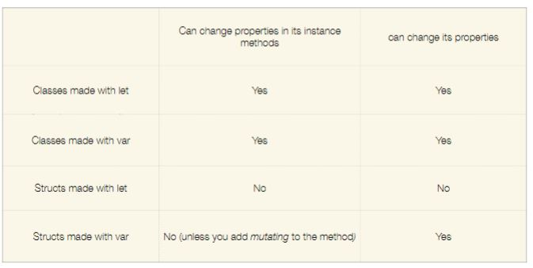

# IOS Development

> A quick guide through Swift and IOS programming concepts.

## Swift 

---

### What is it?

Swift is a **general-purpose**, **multi-paradigm**, compiled programming language developed by Apple Inc.
Swift was developed as a replacement for Apple's earlier programming language Objective-C.

## Syntax and Semantics

- **Syntax** - Determines if a program is well formed.
- **Semantics** - Refers to the meaning of a statement.

A **statement** is a command to perform an action.
In swift we do not need to end a statement with a semi-colon => `;`.

Commenting in Swift:

- `//` => One line comment
- `/* code block */` => Block comments

### Syntax

Let's assume a class called `MyClass`.  
In Swift we name the file the same as the class.

**Keywords**  
This are words reserved with a specific meaning to the compiler and cannot be used for other purposes.

](./appDev/keywords.JPG)

---

## Data Types

Swift is a strongly typed language, meaning that all data consists of a **value** and a **type**.

### Types of Data

- int
- float
- double
- bool
- string
  - Strings in swift are unicode
- char
- optional
- tuples
  - `(code: Int, message : String)`
  - `(s1,s2) = (s2,s1) => //s1 becomes s2 and s2 becomes s1`

#### Variables

A variable refers to a memory location whose contents can be changed during program execution.

All variables must have the following characteristics:

- **Identifier**
- **Value**

Swift has type inference meaning you can either put the type of the variable or not, the compiler will do it for you in case you don't put it. (Only on default values)

##### Identifiers

In swift we have two types of data, **Constants** and **Variables**.

- **`let`** identifier is used for constants.
- **`var`** identifier is used for variables.

We declare variables the following way: **`identifier variableName`**

Examples:

- `let number = 18`
- `var name = "joao"`
- `var name: String`

---

### For loops

---

#### Basic For loop

```swift
for i in 0..<10{
  print(i)
}
```

#### For loop in array

```swift
for element in arr{
  print(element)
}
```

#### For loop in dictionary

```swift
let usersAndModules = ["phil": “COMP228", "boris": "COMP109", "terry": "COMP329", "valli": "COMP318", “stuart" : "COMP39X"]

for (user, module) in usersAndModules {
  print(user, module)
}

```

---

### Functions

Functions are named code blocks. Functions can have arguments and return values and correspond to **procedures** or **methods** in other languages.

```swift
// Declaring a function
func methodName(parameters: Type) -> ReturnType {
    ...
}
```

- **ReturnType** is the type of the value returned.
- **MethodName** an identifier.
- **parameters** a list of arguments, each with an identifier.

Example:

```swift
func sum(a: Int, b: Int){
    return a + b;
}
```

---

### Classes and Structures

#### Classes

**Instance of a class are reference types**

```swift
class SomeClass{
  init(){  }
}
```

#### Structures

**Instance of a class are value types**

```swift
struct SomeStructure{
  init(){  }

}
```

**Creating an instance of a class or struct:**

```swift
let classes = Class()
let structures = Structure()
```

**Some rules**



### Enum

> An object type whose instances represent distinct predefined alternative values

```swift
enum StarWarsRobot{
  case r2_d2 = "R2-D2"
  case c_3po
  case bb_8
  case k_2so
}

let type = StarWarsRobot.r2_d2

func handleRobot(_ : StarWarsRobot) {}

handleRobot((.bb_8))
```
