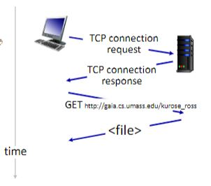
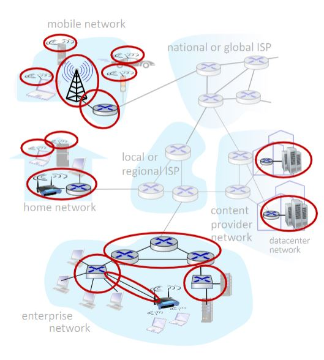
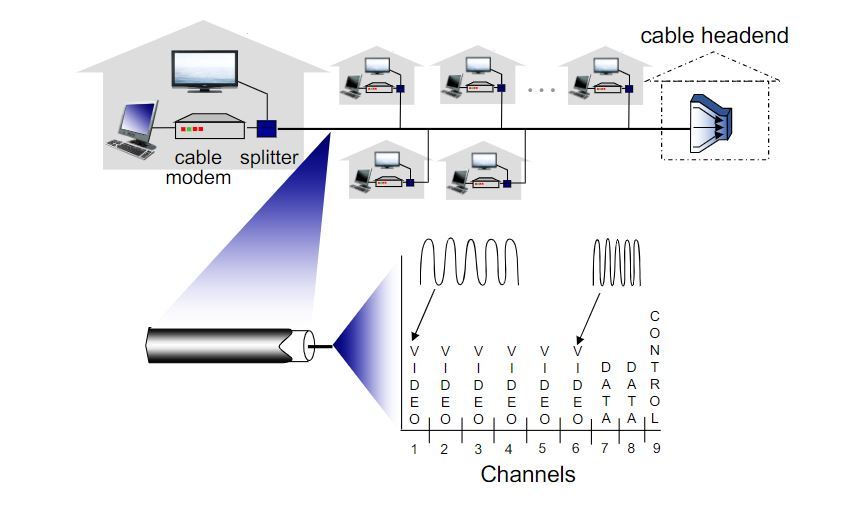
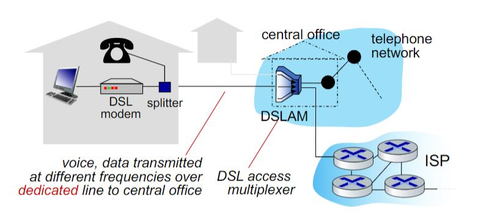
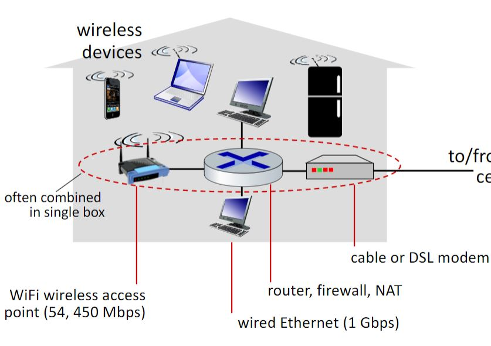
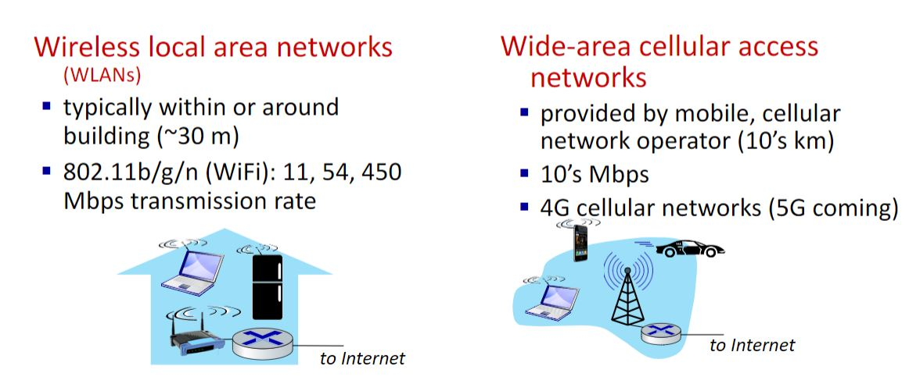

# Computer Networks

> A quick guide through computer networks

## The internet (network of networks)

Interconnected ISPs

- **hosts** => end systems

**Packet switches** => forward packets

- routers, switches

**Comunication Links**

- fiber, copper, radio, satellite
- transmition rate: bandwith

**Networks**

- collection of devices, routers, links: managed by an organization

**Protocols**
Define the format, order of messages sent and received among network entities, and actions taken on msg transmission, receipt.

- control sending, receiving of messages
- HTTP, streaming, video, skype, TCP, IP, Wifi, 4G, Ethernet

### A closer look at internet structure

**Network edge**

- hosts: clients and servers
- servers often in data centers

# Computer Networks

> A quick guide through computer networks

## The internet (network of networks)

Interconnected ISPs

- **hosts** => end systems

**Packet switches** => forward packets

- routers, switches

**Comunication Links**

- fiber, copper, radio, satellite
- transmition rate: bandwith

**Networks**

- collection of devices, routers, links: managed by an organization

**Protocols**
Define the format, order of messages sent and received among network entities, and actions taken on msg transmission, receipt.

- control sending, receiving of messages
- HTTP, streaming, video, skype, TCP, IP, Wifi, 4G, Ethernet

---

## A closer look at internet structure

---

### Network edge

- hosts: clients and servers
- servers often in data centers

### Access networks, physical media

- Wired, wireless comunication links

**Cable based access**

Frequency division multiplexing (**FDM**): different channels transmitted in different frequency bands

- HFC : hybrid fiber coax
  - asymmetric: up to 40 Mbps - 1.2 Gbs downstream and 30 - 100 Mbps upstream
- Network of cable, fiber attaches homes to ISP router

**Digital subscriber line (DSL)**

- Use existing telephone line to central office DSLAM
- 24 - 52 Mbps dedicated downstream
- 3.5 - 16 Mbps dedicated upstream

#### Home Networks

**Wireless access networks**

- Shared wireless access network connects end system to router via base station aka **access point**

### Network core

- Interconnected routers
- Network of networks

### Host
