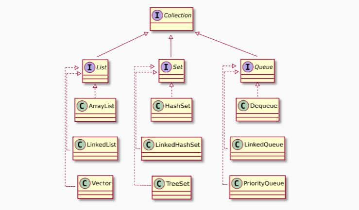

# Object Oriented Programming

> A quick guide through Java and Object-Oriented(OOP) programming concepts.

## Java 

### What is it?

Java is a **high-level** **Object-Oriented** programming language.  
It's both **compiled** and **interpreted**.  
For this Java introduced the **JVM** (Java Virtual Machine) which is an interpreter for compiled **bytecode**.

### Running and Compiling

Java files have the following end `.java`.  
To compile a source-code file named `MyClass.java` we use the following command: `javac MyClass.java`.  
After this command you will see you have a new file ended in `.class`, this is the compiled version of a class.  
To run a java program we use the command `java MyClass`.

---

## Syntax and Semantics

- **Syntax** - Determines if a program is well formed.
- **Semantics** - Refers to the meaning of a statement.

A **statement** is a command to perform an action.
In java every statement ends in a semi-colon => `;`.

Commenting in Java:

- `//` => One line comment
- `/* code block */` => Block comments

### Syntax

Let's assume a class called `MyClass`.  
In Java we name the file the same as the class.
The source code of this class must be:  
`public class MyClass { ..... } `

**Keywords**  
This are words reserved with a specific meaning to the compiler and cannot be used for other purposes.

](./oopJava/keywords.JPG)

**Coding Conventions**

1. **CamelCase** => Class names start with Capital letter, variables and method names with small letters.
2. Code **indentation** should be used.
3. Add comments to explain what your code does.

---

## Data Types

Java is a strongly typed language, meaning that all data consists of a **value** and a **type**.

### Types of Data

- Primitive
  - int
  - byte
  - boolean
  - long
  - short
  - float
  - double
  - char
- Composite
  - String
  - Arrays
  - primitive[] => arrays have **fixed** length and same **type**
  - Collection
  - etc..

#### Variables

A variable refers to a memory location whose contents can be changed during program execution.

All variables must have the following characteristics:

- **Identifier**
- **Value**
- **Type**

##### Identifiers

Sequence of any alphanumeric characters, $ and \_  
**Except** it CANNOT start with number and it cannot be a **keyword**

Variables, as the whole java language are case sensitive.  
**Hello**, **hello** and **heLLo** are all different variables.

We declare variables the following way: `type variableName;`

Examples:

- `double number;`
- `String name;`

We assign values to the variables the following way: `variableName = value;`

Examples:

- `number = 0.1;`
- `name = "Joao";`

We can also perform declaration and initialization at the same time.  
`int[] numbersArray = {1, 2, 3, 4};`

---

### Methods

---

Methods are named code blocks. They are defined inside a class, can have arguments and return values and correspond to **procedures** or **functions** in other languages.

```java
// Declaring a method
modifier returnType methodName(parameters){
    ...
}
```

- **modifiers** determine how the method can be accessed.
- **returnType** is the type of the value returned.
- **methodName** an identifier.
- **parameters** a list of arguments, which have a type and an identifier. Order of the list is **important**

**Warning** => Signature is case/type/quantityOfParams sensitive

If method does not return a value use **void** keyword.

Example:

```java
public static int sum(int a, int b){
    return a + b;
}
```

#### Import

To import libraries we use the keyword `import` on the top of the file where we want to use the library. If we need to use Files we do the following `import java.io.File;`

---

## Objects

An object represents a specific, identifiable part of the world-model.

- It has attributes also called **properties** or **fields**
- It has services, **methods**

### How do we create Objects?

- By **instantiating** a template.
- By copying and adjusting an existing object.

#### Class

A class is a template for an object.

- Tells us which attributes and methods should exist.
- An object can be an instance of a class.

To create an object we need to:

1. Define a class
2. **Instantiate** a new object

##### Defining a class:

```java
public class MyClass{
   //attributes
   private int num1;
   private int num2;

   //method
   public int sum(){
       return num1 + num2;
   }
}
```

##### Instantiating a class:

To instantiate an object we use the keyword **new**.

```java
MyClass mc = new MyClass();
```

#### Constructor

When we instantiate an object a **constructor** method is called to initialize the object.

##### How to create a constructor:

Constructor methods follow two syntax **rules**

1. No return type
2. Same name as the class

```java
//using the above class
public MyClass(){
    this.num1 = 2;
    this.num2 = 6;
}
```

A class **can have multiple constructors** which must have different signatures.

#### Subclass

Inheritance is a mechanism of creating a (sub)class based on an existing (super)class, retaining a similar implementation.

- **Abstraction**: it allows to express “is-a” relationships. Every instance of the subclass is also an instance of the superclass.
- **Code re-use**: a subclass inherits methods/attributes and onlyneeds to implement what’s new.

To specify the relationship sub/superclass we use the keyword **extends**.

```java
public class Triangle extends Shape{
    .....
}
```

Every class in Java has a superclass to the **exception** of the class **Object**.

A subclass inherits **public** and **protected** members of the superclass.

##### Why use inheritance

- Can introduce more abstraction in the code.
- It enhances code re-use.
- It improves the code readability.
- Properly applied, inheritance can reduce software maintenance costs.

##### Overriding and Overloading

- **Overriding** involves providing several methods with the same name and parameter list, but declared in classes which are in a subclass/superclass relationship.
- **Overloading** involves providing several methods with the same name, but different parameter lists.

#### Abstract Class

- Cannot be instantiated but they can be extended and (concrete) subclasses can be.

##### Abstract methods:
- Do not provide a (full) implementation. They have to be overrode by subclasses.

```java
public abstract class Shape{
    .....
}
```

---

## Collections

- Collections are objects.
- They are parametrized by a base type.
- They can be dynamically resized.
- They differ on how and what they can store, and how to access its contents.

We use Collections for the following reasons:

- Avoid (some) errors
- Maximize code reuse
- Ensure inter-operability of the code

### Types of collections



---

## Exceptions

An exception is an object that represents an anomalous situation that requires special processing.  
Exceptions are **objects**.

We use exceptions because:

- Separates the error handling from the logic
- Standardise error handling

To write exception handlers we use the keywords **try** and **catch**.
Example:

```java
try{
    //do something
}catch(IOException er){
    //handle Io exception
}catch(Exception e){
    //handle exception
}finally{
    //code executed in any case
}
```

##### Types of exceptions

- **Checked** - checked at compile-time
- **Unchecked** - checked at run-time

See a list of java exceptions [here](https://programming.guide/java/list-of-java-exceptions.html)
