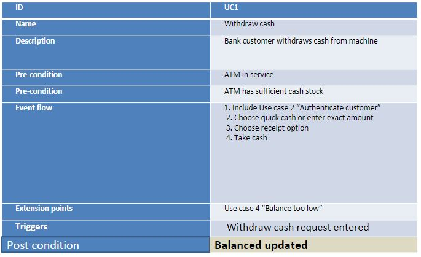

# Software enginneering

> A quick guide through software engineering

## Use Cases

**Show the external vew of the system**.
Are scenario based technique in the UML which identify the actors in an interaction.
A task which the actor needs to perform.

- **Use** -> How you use the system
- **Case** -> An example
- **Actor** -> is a user if the system (Can be human or non-human)

The details of each use case should also be documented by use case description

##### Template

- ID
  - Short ID
- Name
  - Full Name
- Description
  - Full Description
- Pre-condition
  - What must be true before the use case can proceed
- Event flow
  - Flow of behavior that makes up this use case
- Post condition
  - What should be true if the use case successfully completes
- Includes
  - What other use cases are used
- Extensions
  - Optional behavior
- Triggers
  - What Makes this use case happen

**Example**

#### Actors

- Can be human
  - Customer
  - Player
  - Driver
- Can be non-human
  - Sensor
  - Payment Service
  - Geo location
  - Robotic arm

## Software Processes

#### What is a Process?

> Series of activities when providing a service.

**All process have the following characteristics:**

- It prescribes all of the **major activities**
- It uses resources and produces **intermediate and final products**
- It may include sub-processes and **has entry and exit criteria**
- The activities are **organized in a sequence**
- Constraints or controls may apply to activities (budget constraints, availability of resources)

**Software Processes**

> When the process involves the building of some product we refer to the process as a **life cycle**

Coherent sets of activities for software systems

- **Specifying**
- **Designing**
- **Implementing**
- **Testing**

#### Software Process Models

##### The Waterfall Model

Separate and distinct phases of specification and development.

**Problems**:

- Inflexible partitioning of the project into distinct stages making it difficult to respond to changing customer requirements.
- Describes a process of stepwise refinement based on hardware engineering models, widely used in military and aerospace industries.

##### Evolutionary Development

Specification and development are interleaved

Based upon the idea of developing an initial implementation, exposing it to the user and refining it based upon their feedback.

**Problems**:

- Lack of process visibility
- System are sometimes poorly structured

##### Agile and Scrum

Use widely in industry today.
Lightweight approach to software development

**Focused**:

- Code development as code activity
- Test driven development
- Often use pair programming
- Iterative development
- Self organised teams

**Scrum**

- Rather than deliver the system as a single delivery, **the development and delivery is broken down in to increments** (**Scrum Sprints**) with each increment delivering part of the required functionality.
- **User requirements are prioritised** and the highest priority requirements are included in early increments.
- **Once the development of an increment is started the requirements are frozen** though requirements for later increments can continue to evolve.

**Advantages**

- **Customer Value** can be delivered with each increment so system functionality is available earlier.
- **Early increments** act as a prototype to help elicit requirements for later increments.
- **Lower risk of overall project failure**.
- **The highest priority system services** tend to receive the most testing.

## Requirements

- **Functional** - What the system does.
- **Non-Functional** - Constrains on how the functions are provided
